# 墨学书架概要设计说明书

| 项目 | 内容 |
|---|---|
| 文档编号 | MX-HLD-001 |
| 版本 | 1.2.0 |
| 状态 | 评审 v1 整改完成（6 阻断 + Batch D1~D6），待复评 |
| 关联需求 | MX-SRS-001 |
| 目标平台 | HarmonyOS 平板 |
| 编写日期 | 2026-06-19 |

## 修订历史

| 版本 | 日期 | 评审/批准状态 | 变更摘要 |
|---|---|---|---|
| 1.0.0 | 2026-06-19 | 基线版 | 初稿。 |
| 1.1.0 | 2026-06-19 | 待复评 | 规格评审 v1：6 条阻断项 + Batch D1（数据流）/D2（状态机与事务）整改。 |
| 1.2.0 | 2026-06-19 | 待复评 | Batch D3~D6（接口契约 / 数据库约束 / 页面交互 / 测试·NFR）+ D7 全量一致性审计。变更日志见根目录 `CHANGELOG.md`，逐条裁决见《[已知冲突与裁决记录](../已知冲突与裁决记录.md)》（承载 CLAUDE.md §3 问题登记）。 |

## 1. 设计目标

本设计将产品拆成可独立开发、测试和替换的模块。应用本身只消费结构化学习包，不承担 PDF OCR。
所有核心学习功能离线运行，手写笔是练习和批注的第一输入方式。

## 2. 总体架构


### 2.1 分层

| 层 | 职责 |
|---|---|
| Presentation | ArkUI 页面、组件、页面状态、无障碍和手写交互 |
| ViewModel | 页面状态编排、加载/错误/空状态、导航命令 |
| Domain | 导入规则、判分规则、复习调度、学习时长计算 |
| Repository | 数据库与文件仓的统一访问接口 |
| Infrastructure | RDB、文件系统、ZIP、安全校验、哈希、识别模型 |

页面不得越过 Repository 直接访问数据库或学习包文件。

## 3. 核心模块

### 3.1 学习包导入模块

职责：

- 接收系统文件选择器返回的 URI。
- 复制到应用临时区。
- 执行 ZIP 安全和资源限制检查。
- 读取 `manifest.json`，判断协议兼容性。
- 校验 JSON Schema、引用、哈希和业务一致性。
- 解压到隔离暂存目录。
- 在数据库事务中建立索引。
- 原子移动到正式书籍目录。
- 失败时回滚数据库并清理暂存目录。

### 3.2 课程内容模块

职责：

- 提供书籍、目录、章节、小节和内容块。
- 将 JSON 内容块映射到 ArkUI 组件。
- 记录阅读位置和章节状态。
- 管理资源文件和缺失资源降级。

### 3.3 手写与识别模块

职责：

- 采集笔迹点、压力、时间和笔画边界。
- 即时渲染墨迹。
- 执行防手掌误触。
- 保存书写草稿；停笔时不自动提交识别。
- 用户点击“确认答案”后调用可替换的英文手写识别 Provider。
- 保存原始笔迹和服务返回的识别文本。

识别 Provider 的选型和发布门槛必须通过
[《手写识别验收规范》](./05-手写识别验收规范.md)，不得以演示样例或主观体验代替
`MX-HWR-EN-2000-v1` 固定测试集结果。

#### 3.3.1 识别能力选型论证与不可用降级（R-065）

**候选与约束**：第一版默认采用 HarmonyOS MindSpore Lite Kit 承载的离线英文手写识别模型；候选 Provider 须在《手写识别验收规范》基准设备（§3，≥8GB 内存、HarmonyOS 平板）上同时给出**模型体积、常驻内存、P95 推理时延、`MX-HWR-EN-2000-v1` 实测准确率**四项指标，并说明随应用分发还是按需下载。任一指标不达 NFR-P-004/NFR-P-007 即不得作为发布 Provider。识别实现必须可替换，页面与判分引擎不依赖具体模型（§8）。

**模型不可用降级（产品级兜底）**：当设备无可用识别模型或模型加载失败时，区别于单次「识别失败」，**不进入无限重试**，而是进入「识别能力不可用」降级态——保留并展示笔迹、停用「确认答案」判分、提示「当前设备暂不支持手写判分」，其余学习功能（阅读、笔记、复习卡的非判分部分）不受影响。该降级态登记到 §9 错误处理表，对应 LLD §4.2 识别状态机的 `service-unavailable`/`internal-error` 码（LLD §3.14A）与 NFR-R-005。

### 3.4 判分模块

职责：

- 标准化识别文本。
- 匹配标准答案和可接受答案。
- 执行学习包提供的部分正确和语法规则。
- 生成可理解的反馈。
- 更新练习记录、错题和掌握度。

### 3.5 复习与错题模块

职责：

- 维护复习卡片状态和到期时间。
- 收集错误、部分正确和重复错误。
- 从章节、错题和卡片返回原始知识点。

### 3.6 统计模块

职责：

- 记录学习事件。
- 计算有效学习时长、练习数、正确率和连续学习。
- 支持按天、周、月和书籍聚合。

### 3.7 设置与数据模块

职责：

- 管理笔迹参数、识别阈值、复习偏好。
- 统计本地空间。
- 导出和恢复学习数据。
- 清理可再生缓存。

## 4. 主要业务流程

### 4.1 导入流程

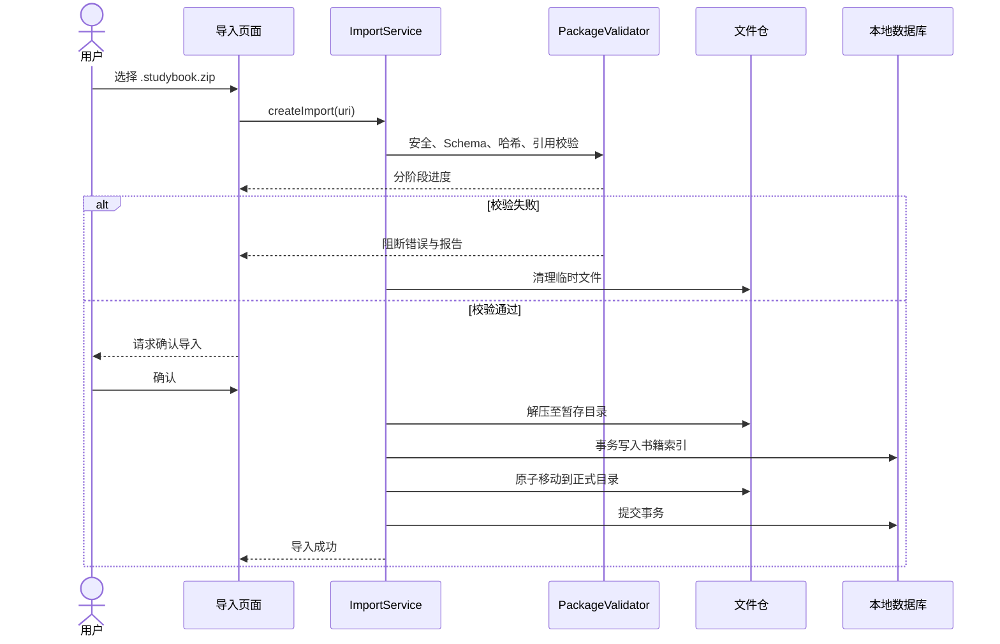

### 4.2 章节学习流程

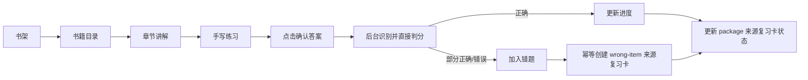

### 4.3 手写识别与判分流程

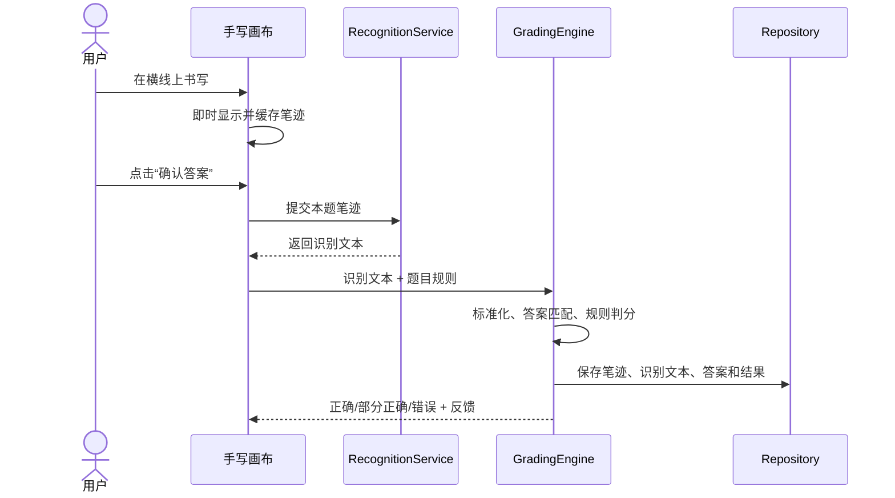

### 4.4 复习卡创建流程

复习卡不是页面临时生成的数据，由以下两个服务负责写入：

1. `ImportService` 在学习包索引阶段，把章节 `flashcards[]` 转换为
   `review_cards(source_type='package')`。幂等键为
   `(source_type='package', source_id=<bookId>:<flashcardExternalId>)`。
2. `AttemptOrchestrator` 在一次练习判分落库后处理错题：
   - `grade=partial|incorrect` 时先 upsert `wrong_items`；
   - 随后幂等创建或恢复
     `review_cards(source_type='wrong-item', source_id=<wrongItemId>)`；
   - `grade=correct` 不新建错题卡，只更新已存在卡片的学习证据。

第一版不支持用户手工创建复习卡，因此 `source_type` 不包含 `user`。
创建初值统一为：

```text
state = new
ease_factor = 2.5
interval_days = 0
due_at = created_at
lapses = 0
```

导入事务或答题事务失败时，复习卡写入必须随同回滚，不能产生无来源卡片。

## 5. 功能交互概要

### 5.1 F01 书架

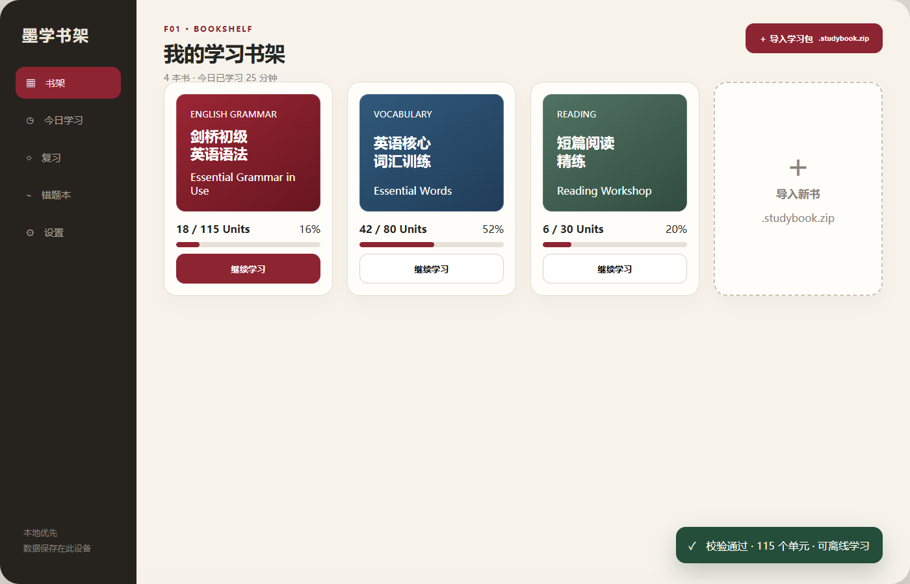

- 进入应用默认落在书架。
- 点击书籍主体进入目录；点击“继续学习”直接恢复上次位置。
- 长按或更多菜单提供书籍信息、导出记录、更新和删除。
- 导入成功后在右下角短暂显示结果，书籍卡立即插入。

### 5.2 F02 导入选择

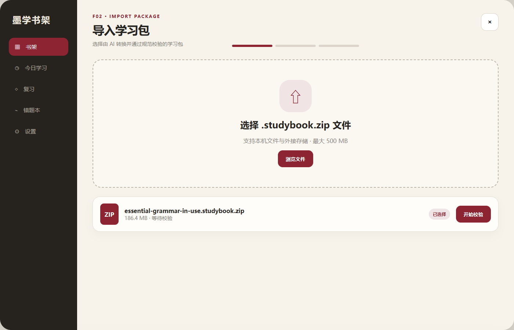

- 用户点击“导入学习包”后调用系统文件选择器。
- 选择完成后显示文件摘要，用户再次确认“开始校验”。
- 文件类型、大小或空间不足在此阶段直接阻断。

### 5.3 F03 校验结果

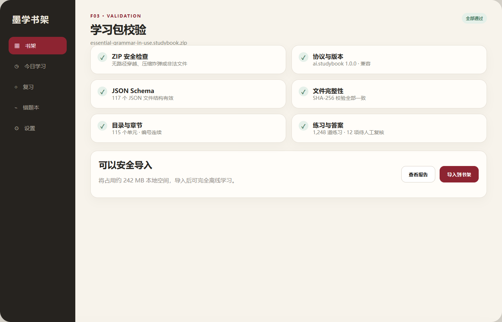

- 校验按阶段推进，每个阶段有独立状态。
- 阻断错误不出现“导入到书架”按钮。
- 非阻断警告可以查看报告，但必须由用户确认后继续。
- 导入过程离开页面时在系统任务区保持状态，完成后通知书架刷新。

### 5.4 F04 书籍目录

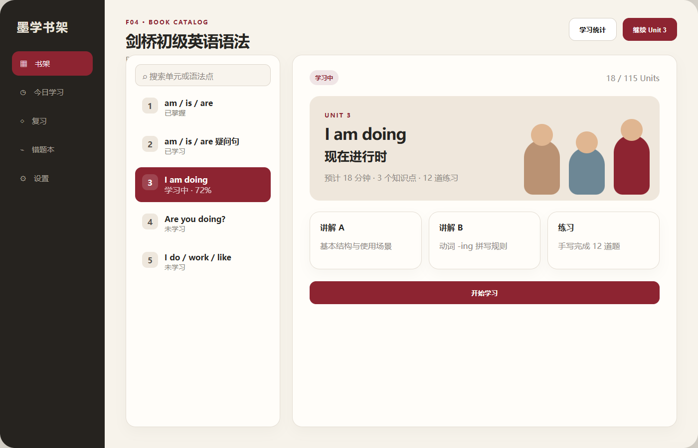

- 左侧为可搜索章节目录，右侧为选中章节预览。
- 点击章节只改变预览；点击“开始学习”才进入章节。
- 返回目录保持筛选条件和滚动位置。

### 5.5 F05 章节讲解

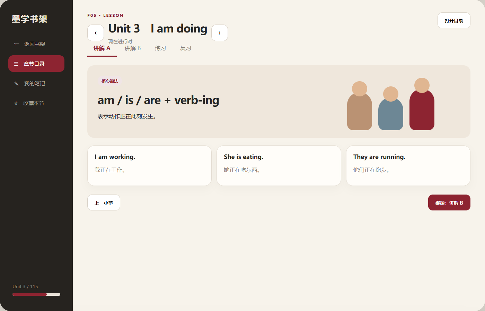

- 顶部上一章/下一章按钮切换章节。
- “打开目录”使用侧边抽屉，不覆盖用户当前阅读位置。
- 章节内标签切换讲解、练习和复习。
- 章节切换不绑定水平滑动，避免与笔迹冲突。

### 5.6 F06 手写练习

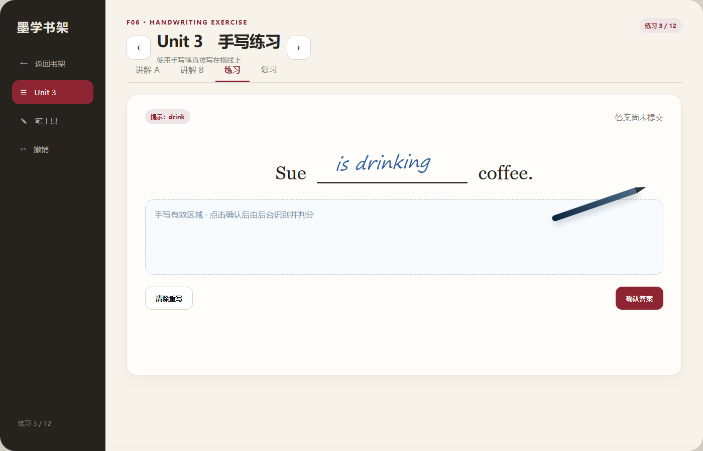

- 横线同时是视觉元素和独立手写目标区域。
- 墨迹绘制和识别异步分离，识别慢时不影响书写。
- “清除重写”只清除当前空；多空题可以逐空编辑。
- 用户点击“确认答案”后进入识别与判分状态。

### 5.7 F07 识别与判分

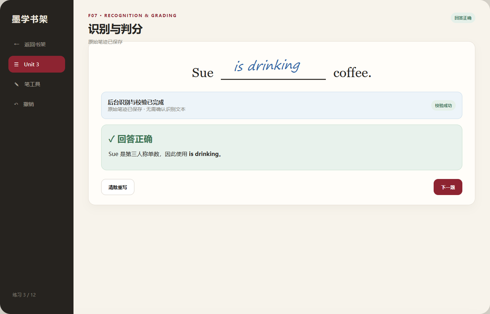

- 识别服务返回文本后直接进入判分，不展示置信度和候选词。
- 用户无需二次确认识别结果；判分完成后直接显示正确、部分正确或错误反馈。
- 若识别服务失败或没有返回有效文本，保留原始笔迹并允许重试或重写。
- 判分后展示结果、解释和下一题。
- 错误/部分正确同步写入错题本，但不打断当前练习会话。

### 5.8 F08 笔记与批注

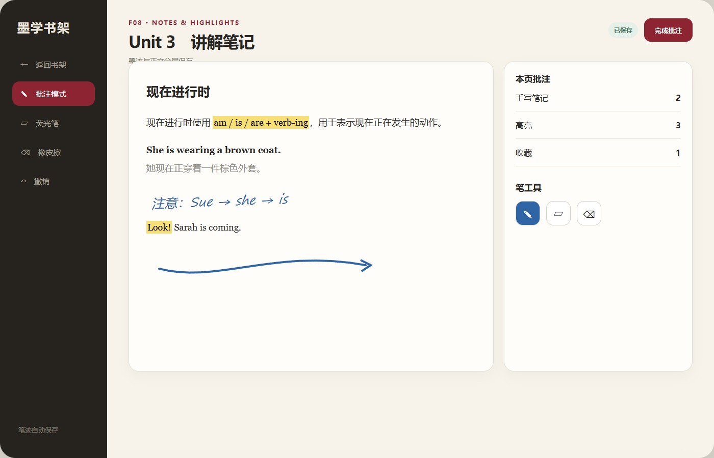

- 进入批注模式后正文保持只读，笔迹绘制在独立图层。
- 高亮锚定文本范围，手写笔记锚定内容块坐标。
- 自动保存采用“内存缓冲 + 周期快照 + 页面退出强制落盘”。

### 5.9 F09 复习卡片

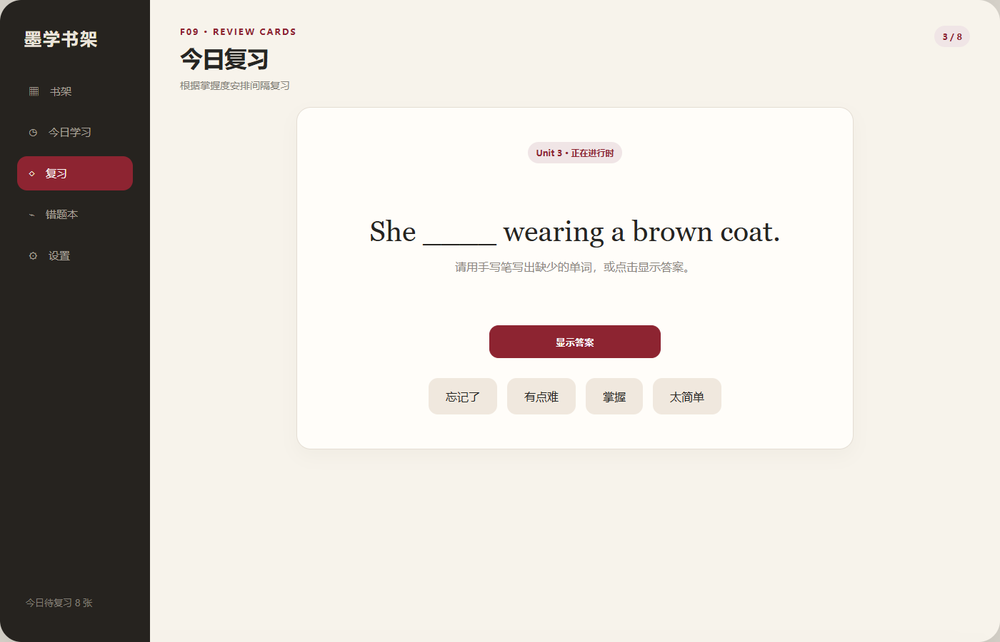

- 首页显示到期数量，进入后逐张复习。
- 用户先回忆或手写，再显示答案并评定难度。
- 评分立即改变下次到期时间。

### 5.10 F10 错题本

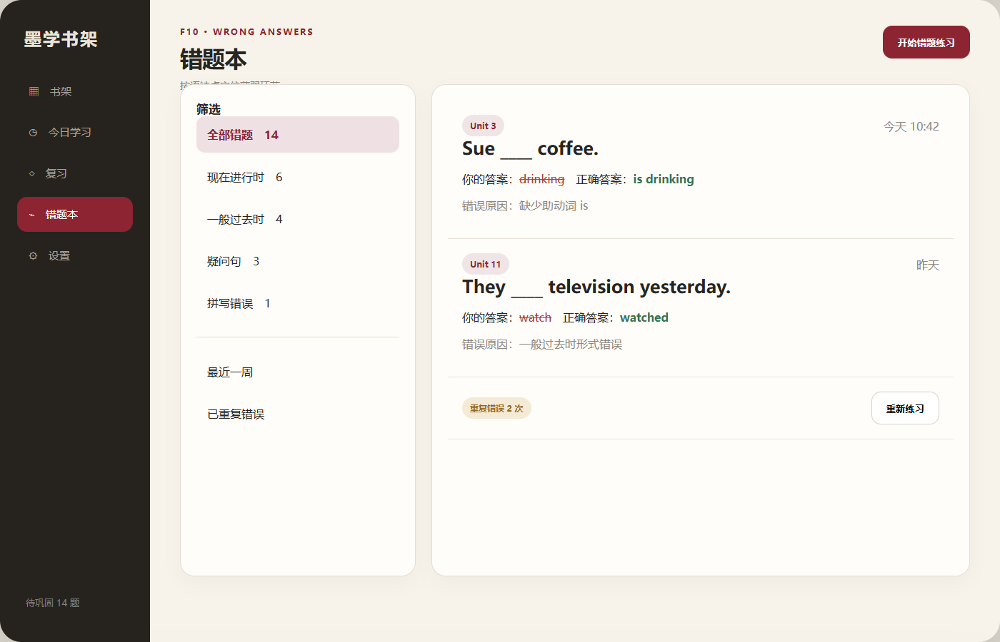

- 左侧筛选，右侧展示错误详情。
- 点击“重新练习”复用原练习渲染器。
- 正确重做增加掌握证据，不覆盖过去错误。

### 5.11 F11 学习统计

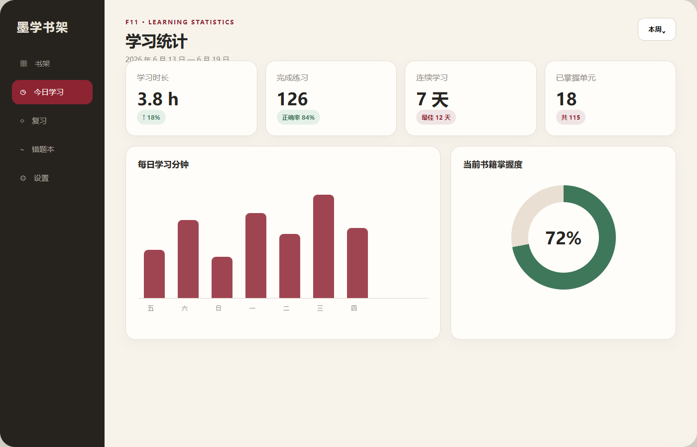

- 顶部时间范围影响全部指标与图表。
- 指标由事件和答题记录计算，不由页面自行累加。
- 点击薄弱知识点可跳转到对应错题或章节。

### 5.12 F12 设置与数据

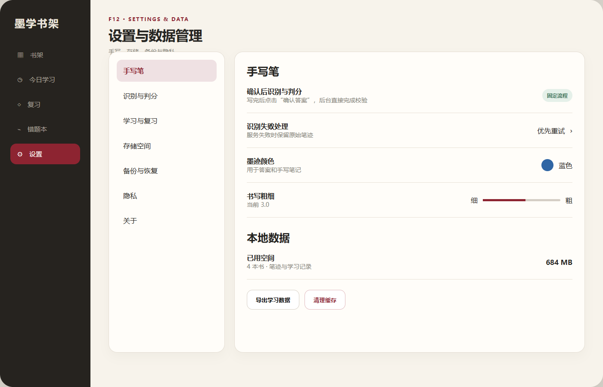

- 设置修改通过统一 SettingsService 持久化。
- 危险操作与普通设置分区。
- 清理缓存先计算影响范围；正文、笔迹和进度不属于缓存。

## 6. 导航设计

```text
BookshelfPage
├── ImportPackagePage
│   └── ImportValidationPage
├── BookCatalogPage
│   └── LessonPage
│       ├── ExplanationTab
│       ├── ExerciseTab
│       ├── RecognitionResultState
│       └── NotesOverlay
├── ReviewPage
├── WrongBookPage
├── StatisticsPage
└── SettingsPage
```

导航约束：

- 使用明确路由参数 `bookId`、`chapterId`、`sectionId`、`exerciseId`。
- 不将完整章节 JSON 放入路由参数。
- 深层页面返回时恢复上层列表状态。
- 导入流程离开时必须明确取消还是后台继续。

## 7. 数据存储概要

### 7.1 文件仓

```text
app-data/
  books/<bookId>/
    package/
      manifest.json
      book.json
      chapters/
      assets/
    derived/
      thumbnails/
  handwriting/<bookId>/<chapterId>/
  exports/
  cache/
  temp/import/<jobId>/
```

### 7.2 数据库

本地关系数据库保存：

- 书籍和章节索引。
- 学习进度。
- 练习、答案索引和答题记录。
- 笔迹元数据、笔记、高亮和收藏。
- 复习卡、错题和统计事件。
- 导入任务、设置和迁移版本。

大体积图片和笔迹文件保存在文件仓，数据库只保存路径、哈希和元数据。

## 8. 关键接口边界

所有 DTO 字段、可空性和枚举以
[《接口与 DTO 契约》](./04-接口与DTO契约.md)为唯一真值。本节只展示模块边界。

```ts
interface PackageValidator {
  validate(sourceUri: string, options: ValidationOptions): AsyncIterable<ValidationEvent>;
}

interface BooksRepository {
  list(query: BookListQuery): Promise<BookSummary[]>;
  get(bookId: string): Promise<BookDetail>;
  listChapters(bookId: string): Promise<ChapterSummary[]>;
  searchChapters(bookId: string, keyword: string): Promise<SearchResult[]>;
}

interface HandwritingRecognizer {
  recognize(input: StrokeDocument, mode: HandwritingMode): RecognitionHandle;
}

interface GradingEngine {
  grade(rules: ExerciseRules, answers: ConfirmedAnswer[]): GradeResult;
}

interface ReviewRepository {
  upsertFromSource(input: CreateReviewCardInput): Promise<ReviewCard>;
  getDue(now: number, bookId?: string): Promise<ReviewCard[]>;
}

interface ReviewScheduler {
  createSession(now: number, bookId?: string): Promise<ReviewSession>;
  applyRating(cardId: string, rating: ReviewRating, now: number): Promise<ScheduleResult>;
}
```

识别实现必须可替换；页面和判分引擎不得依赖某个具体模型。

## 9. 错误处理概要

| 类别 | 处理 |
|---|---|
| 用户取消 | 返回上一页，不显示错误 |
| 输入包错误 | 展示明确错误码、文件或 JSON 路径 |
| 存储不足 | 导入前阻断，提示所需空间 |
| 识别失败 | 保留笔迹，提示重试或重写，不产生判分结果 |
| 识别能力不可用（无模型/加载失败） | 保留笔迹，停用判分并提示设备不支持，其余功能可用（R-065，见 §3.3.1） |
| 数据库失败 | 回滚事务并保留可诊断错误 |
| 图片缺失 | 显示 alt，章节文字继续可用 |
| 内容升级冲突 | 保留用户数据，冲突批注进入待重新定位 |

## 10. 性能策略

- 书架只加载缩略图和摘要。
- 章节按需读取，不一次解析整本书的所有内容。
- 图片按显示尺寸解码并缓存缩略图。
- 手写绘制在 UI 快路径，识别和落盘在后台任务。
- 学习统计采用事件增量聚合，并允许离线重算。
- 导入时分批写数据库，最终一次提交。

## 11. 安全设计概要

- 导入包视为不可信。
- 解压前检查条目路径、数量、大小、压缩比和允许扩展名。
- 解压目标必须限制在任务暂存目录。
- 校验实际解压文件哈希，不能只信任 ZIP 目录信息。
- JSON 解析后再执行 Schema 与业务规则校验。
- 正式书籍目录只在校验与数据库事务成功后可见。
- **判分规则来自不可信包，必须防 ReDoS（R-044）**：`grading_rules.rule_type='regex'` 的正则源来自学习包，导入期做静态校验（源串长度上限、禁止嵌套量词等灾难性回溯模式），运行期对匹配输入设长度上限与单条规则硬超时并可取消，超时降级为 `incorrect`/`recognition-failed`，绝不让判分阻塞「确认答案」交互路径（NFR-P-004）。`custom-code` 只能引用应用内置白名单规则，不执行包内脚本。详见 LLD §3.11。

## 12. 技术依据

实现时以华为官方 HarmonyOS 文档为准：

- [Pen Kit](https://developer.huawei.com/consumer/cn/doc/harmonyos-guides/pen-suite)
- [ArkUI Navigation](https://developer.huawei.com/consumer/cn/doc/harmonyos-guides/arkts-navigation-navigation)
- [关系型数据库 relationalStore](https://developer.huawei.com/consumer/cn/doc/harmonyos-guides/data-persistence-by-rdb-store)
- [DocumentViewPicker 文件选择](https://developer.huawei.com/consumer/cn/doc/harmonyos-references/js-apis-file-picker)
- [MindSpore Lite Kit](https://developer.huawei.com/consumer/cn/doc/harmonyos-guides/mindspore-lite-kit-introduction)
