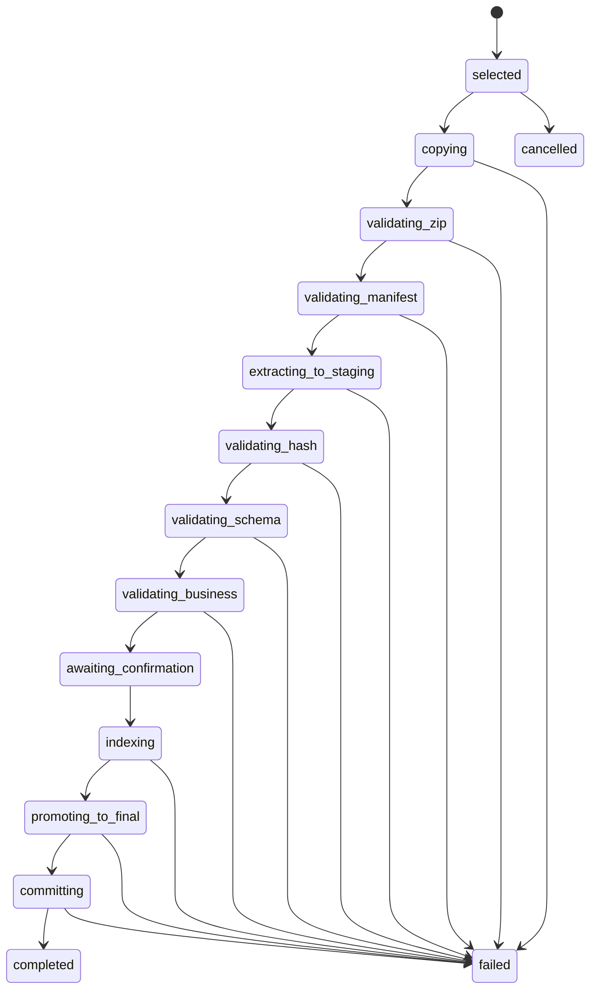
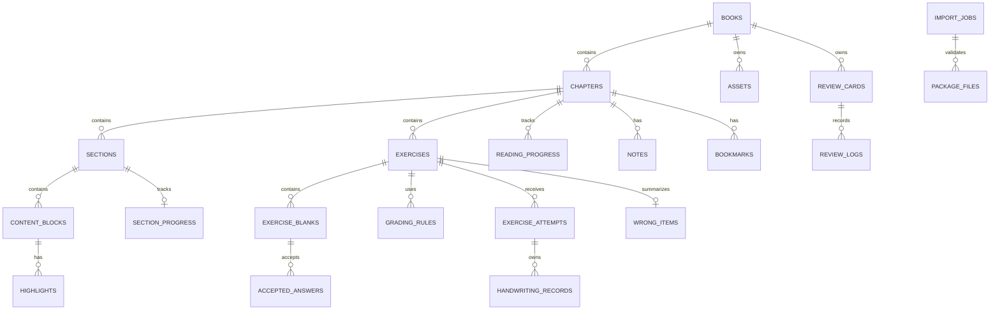

# 墨学书架详细设计说明书

| 项目 | 内容 |
|---|---|
| 文档编号 | MX-LLD-001 |
| 版本 | 1.1.0 |
| 状态 | 阻断项修订完成，待复评 |
| 关联文档 | MX-SRS-001、MX-HLD-001 |
| 目标平台 | HarmonyOS 平板 |
| 编写日期 | 2026-06-19 |

## 1. 设计约定

### 1.1 技术栈

- 语言：ArkTS。
- UI：ArkUI。
- 导航：Navigation。
- 本地关系数据：`relationalStore`。
- 文件选择：系统 `DocumentViewPicker`。
- 手写：Pen Kit/ArkUI 指针事件与独立墨迹层。
- 离线识别：通过 `HandwritingRecognizer` 接口封装，具体实现可使用适配的本地模型能力。
- 学习包：`ai.studybook` `.studybook.zip`。

### 1.2 代码模块

```text
entry/src/main/ets/
  pages/
    bookshelf/
    import/
    catalog/
    lesson/
    review/
    wrongbook/
    statistics/
    settings/
  components/
    content-blocks/
    handwriting/
    exercise/
    common/
  viewmodels/
  domain/
    entities/
    grading/
    review/
    import/
  repositories/
  services/
  database/
    migrations/
    dao/
  storage/
  recognition/
  utils/
```

### 1.3 通用数据约束

- 内部主键：`TEXT`，使用 UUIDv7 或等价有序唯一 ID。
- 学习包外部 ID：单独存为 `external_id`，不得直接假设跨书唯一。
- 时间：`INTEGER`，UTC Unix epoch milliseconds。
- 布尔：`INTEGER NOT NULL CHECK(value IN (0,1))`。
- 枚举：`TEXT`，数据库 `CHECK` 与 ArkTS 联合类型双重约束。
- JSON：`TEXT`，写入前必须解析、校验和重新序列化。
- 文件路径：只保存应用沙箱内相对路径，不保存用户文件绝对路径。
- 数据库启用外键；所有迁移必须单调递增。
- 用户数据表采用软删除时必须有 `deleted_at`，查询默认排除已删除数据。

## 2. 学习包与文件系统设计

### 2.1 ZIP 资源限制

| 项目 | 限制 |
|---|---|
| 压缩包大小 | ≤ 500 MB |
| 解压后总大小 | ≤ 2 GB |
| ZIP 条目数 | ≤ 10,000 |
| 单个 JSON | ≤ 10 MB |
| 单张图片 | ≤ 8 MB |
| 单个其他允许文件 | ≤ 32 MB |
| 最大压缩比 | 100:1 |
| 路径深度 | ≤ 8 |
| 单段文件名长度 | ≤ 120 字符 |
| 完整相对路径长度 | ≤ 240 字符 |

允许扩展名：

```text
.json .webp .png .jpg .jpeg
```

第一版禁止 `.svg`、HTML、脚本、动态库、可执行文件和嵌套 ZIP。

### 2.2 正式目录

```text
files/
  books/<bookId>/
    package/
      manifest.json
      book.json
      report.json
      chapters/
      assets/
    derived/
      cover-thumb.webp
      image-cache/
  handwriting/<bookId>/<chapterId>/*.stroke.json.gz
  notes/<bookId>/<chapterId>/*.stroke.json.gz
  exports/
cache/
  images/
  recognition/
temp/
  import/<jobId>/
```

### 2.3 导入状态机



失败处理：

1. 标记 `import_jobs.state = failed`。
2. 回滚未提交数据库事务。
3. 删除任务暂存目录。
4. 若已创建回滚点，恢复旧书籍目录。
5. 保留不含敏感内容的错误摘要。

### 2.4 校验顺序

1. 文件头和 MIME 确认为 ZIP。
2. 枚举条目，不解压即检查路径、条目数、大小、压缩比。
3. 读取并校验 `manifest.json`。
4. 检查协议主版本兼容性。
5. 校验必需文件和允许扩展名。
6. 解压到唯一隔离暂存目录，状态为 `extracting_to_staging`；该目录对书架不可见。
7. 对暂存目录内文件逐个计算 SHA-256 并比对 `checksums.json`。
8. 使用应用内置 JSON Schema 校验暂存目录内的结构化文件。
9. 校验目录、ID、文件引用、章节顺序、练习空位和答案。
10. 生成应用端校验报告并进入 `awaiting_confirmation`。
11. 用户确认后执行 `indexing`，在数据库事务中建立内容索引。
12. 索引成功后将暂存目录原子提升到正式目录，状态为 `promoting_to_final`。
13. 提交数据库事务并进入 `completed`。

`awaiting_confirmation` 之前的“解压”只写入任务隔离暂存区，不属于安装到书架；
确认后不得再次解压。数据库提交失败或目录提升失败时按失败处理规则清理正式目录并回滚。

### 2.5 导入错误码

| 错误码 | 含义 | 是否阻断 |
|---|---|---|
| IMP-001 | 不是有效 ZIP | 是 |
| IMP-002 | ZIP 路径穿越 | 是 |
| IMP-003 | 条目数量或大小超限 | 是 |
| IMP-004 | 疑似压缩炸弹 | 是 |
| IMP-005 | 缺少 manifest.json | 是 |
| IMP-006 | 协议主版本不兼容 | 是 |
| IMP-007 | JSON 解析失败 | 是 |
| IMP-008 | Schema 校验失败 | 是 |
| IMP-009 | SHA-256 不一致 | 是 |
| IMP-010 | 内部文件引用缺失 | 是 |
| IMP-011 | 章节 ID/顺序冲突 | 是 |
| IMP-012 | 可判分练习缺少答案 | 是 |
| IMP-013 | 存储空间不足 | 是 |
| IMP-014 | 重复版本 | 否，需用户选择 |
| IMP-015 | 存在待人工复核内容 | 否，警告 |
| IMP-016 | 数据库提交失败 | 是 |
| IMP-020 | 存在第一版不支持的练习题型 | 是 |

## 3. 数据库设计

### 3.1 实体关系



### 3.2 `db_meta`

| 字段 | 类型 | 约束 | 说明 |
|---|---|---|---|
| key | TEXT | PK, NOT NULL | 元数据键 |
| value | TEXT | NOT NULL | 值 |
| updated_at | INTEGER | NOT NULL | 更新时间 |

必需键：`schema_version`、`created_at`、`last_migration_at`。

### 3.3 `books`

| 字段 | 类型 | 约束 | 说明 |
|---|---|---|---|
| id | TEXT | PK, NOT NULL | 内部书籍 ID |
| package_id | TEXT | NOT NULL | manifest.packageId |
| content_version | TEXT | NOT NULL | 内容版本 |
| format_version | TEXT | NOT NULL | 协议版本 |
| title | TEXT | NOT NULL, 长度 1..200 | 书名 |
| subtitle | TEXT | NOT NULL DEFAULT '' | 副标题 |
| authors_json | TEXT | NOT NULL DEFAULT '[]' | 作者数组 |
| description | TEXT | NOT NULL DEFAULT '' | 简介 |
| languages_json | TEXT | NOT NULL DEFAULT '[]' | 语言数组 |
| cover_path | TEXT | NULL | 沙箱相对路径 |
| chapter_count | INTEGER | NOT NULL CHECK >= 1 | 章节数 |
| source_page_count | INTEGER | NULL CHECK > 0 | 原 PDF 页数，仅追溯 |
| source_is_scanned | INTEGER | NOT NULL CHECK IN (0,1) | 是否扫描版 |
| status | TEXT | NOT NULL CHECK IN (`ready`,`updating`,`broken`,`deleted`) | 状态 |
| imported_at | INTEGER | NOT NULL | 导入时间 |
| updated_at | INTEGER | NOT NULL | 内容更新时间 |
| last_opened_at | INTEGER | NULL | 最近打开 |
| deleted_at | INTEGER | NULL | 软删除 |

约束与索引：

- `UNIQUE(package_id, content_version)`。
- 索引：`status`、`last_opened_at DESC`、`title`。
- `chapter_count` 必须与有效章节记录数一致，由导入服务校验。

### 3.4 `chapters`

| 字段 | 类型 | 约束 | 说明 |
|---|---|---|---|
| id | TEXT | PK | 内部章节 ID |
| book_id | TEXT | FK books.id ON DELETE CASCADE | 所属书 |
| external_id | TEXT | NOT NULL | 学习包章节 ID |
| order_no | INTEGER | NOT NULL CHECK >= 1 | 目录顺序 |
| kind | TEXT | CHECK IN (`lesson`,`review`,`appendix`,`answer-key`,`index`) | 类型 |
| title | TEXT | NOT NULL | 英文/主标题 |
| title_zh | TEXT | NOT NULL DEFAULT '' | 中文标题 |
| estimated_minutes | INTEGER | NOT NULL DEFAULT 1 CHECK >= 1 | 预计时间 |
| source_pages_json | TEXT | NOT NULL | 来源页数组 |
| content_file | TEXT | NOT NULL | 章节 JSON 相对路径 |
| content_hash | TEXT | NOT NULL, 长度 64 | SHA-256 |
| review_status | TEXT | CHECK IN (`unreviewed`,`needs-review`,`reviewed`) | 内容复核状态 |
| created_at | INTEGER | NOT NULL | 创建时间 |
| updated_at | INTEGER | NOT NULL | 更新时间 |

约束与索引：

- `UNIQUE(book_id, external_id)`。
- `UNIQUE(book_id, order_no)`。
- 索引：`book_id, kind, order_no`。

### 3.5 `sections`

| 字段 | 类型 | 约束 | 说明 |
|---|---|---|---|
| id | TEXT | PK | 内部小节 ID |
| chapter_id | TEXT | FK chapters.id ON DELETE CASCADE | 所属章节 |
| external_id | TEXT | NOT NULL | 学习包小节 ID |
| order_no | INTEGER | NOT NULL CHECK >= 1 | 顺序 |
| type | TEXT | CHECK IN (`concept`,`rule`,`examples`,`comparison`,`spelling`,`note`,`illustration`,`summary`) | 小节类型 |
| title | TEXT | NOT NULL DEFAULT '' | 标题 |
| source_pages_json | TEXT | NOT NULL | 来源页 |
| confidence | REAL | NOT NULL CHECK BETWEEN 0 AND 1 | 内容置信度 |

约束：`UNIQUE(chapter_id, external_id)`、`UNIQUE(chapter_id, order_no)`。

### 3.6 `content_blocks`

| 字段 | 类型 | 约束 | 说明 |
|---|---|---|---|
| id | TEXT | PK | 内容块 ID |
| section_id | TEXT | FK sections.id ON DELETE CASCADE | 所属小节 |
| external_id | TEXT | NULL | 外部 ID |
| order_no | INTEGER | NOT NULL CHECK >= 1 | 顺序 |
| type | TEXT | NOT NULL | paragraph/formula/example/table 等 |
| payload_json | TEXT | NOT NULL | 完整结构数据 |
| plain_text | TEXT | NOT NULL DEFAULT '' | 搜索与无障碍文本 |
| asset_id | TEXT | FK assets.id ON DELETE SET NULL | 可选资源 |
| source_pages_json | TEXT | NOT NULL | 来源页 |

约束：

- `UNIQUE(section_id, order_no)`。
- `type` 必须在渲染器白名单中，否则显示“暂不支持的内容块”而不是崩溃。
- 索引：`section_id, order_no`、`plain_text`。

### 3.7 `assets`

| 字段 | 类型 | 约束 | 说明 |
|---|---|---|---|
| id | TEXT | PK | 资源 ID |
| book_id | TEXT | FK books.id ON DELETE CASCADE | 所属书 |
| relative_path | TEXT | NOT NULL | 包内相对路径 |
| local_path | TEXT | NOT NULL | 沙箱相对路径 |
| media_type | TEXT | CHECK IN (`image/webp`,`image/png`,`image/jpeg`) | 类型 |
| sha256 | TEXT | NOT NULL, 长度 64 | 哈希 |
| size_bytes | INTEGER | NOT NULL CHECK >= 0 | 大小 |
| width_px | INTEGER | NULL CHECK > 0 | 宽 |
| height_px | INTEGER | NULL CHECK > 0 | 高 |
| alt_text | TEXT | NOT NULL DEFAULT '' | 替代文本 |

约束：`UNIQUE(book_id, relative_path)`、`UNIQUE(book_id, sha256, relative_path)`。

### 3.8 `exercises`

| 字段 | 类型 | 约束 | 说明 |
|---|---|---|---|
| id | TEXT | PK | 练习 ID |
| chapter_id | TEXT | FK chapters.id ON DELETE CASCADE | 所属章节 |
| external_id | TEXT | NOT NULL | 包内 ID |
| order_no | INTEGER | NOT NULL CHECK >= 1 | 顺序 |
| type | TEXT | NOT NULL | 题型 |
| instruction | TEXT | NOT NULL DEFAULT '' | 指令 |
| prompt_json | TEXT | NOT NULL | 文本段与 blank 段 |
| context_json | TEXT | NOT NULL DEFAULT '{}' | 提示、图片等 |
| feedback_json | TEXT | NOT NULL DEFAULT '{}' | 通用反馈 |
| source_ref_json | TEXT | NOT NULL | 来源 |
| answer_source | TEXT | CHECK IN (`answer-key`,`explicit-in-page`,`ai-inferred`,`manual`) | 答案来源 |
| confidence | REAL | NOT NULL CHECK BETWEEN 0 AND 1 | 内容置信度 |
| enabled | INTEGER | NOT NULL DEFAULT 1 CHECK IN (0,1) | 是否可作答 |

约束：`UNIQUE(chapter_id, external_id)`、`UNIQUE(chapter_id, order_no)`。

允许题型：

```text
fill-blank-handwriting
multi-blank-handwriting
rewrite-sentence-handwriting
short-answer-handwriting
correction-handwriting
```

第一版只实现上述五种手写题型。业务校验必须拒绝其他 `type`，错误码为
`IMP-020 unsupported-exercise-type`；不得把不支持题型以 `enabled=0` 静默导入。

### 3.9 `exercise_blanks`

| 字段 | 类型 | 约束 | 说明 |
|---|---|---|---|
| id | TEXT | PK | 空位 ID |
| exercise_id | TEXT | FK exercises.id ON DELETE CASCADE | 所属练习 |
| blank_key | TEXT | NOT NULL | prompt 中的 blank id |
| order_no | INTEGER | NOT NULL CHECK >= 1 | 空位顺序 |
| width_em | REAL | NOT NULL CHECK BETWEEN 3 AND 40 | 横线建议宽度 |
| lines | INTEGER | NOT NULL DEFAULT 1 CHECK BETWEEN 1 AND 5 | 行数 |
| handwriting_mode | TEXT | CHECK IN (`english`,`number`,`mixed`) | 识别模式 |
| display_answer | TEXT | NOT NULL | 主答案 |
| tokens_json | TEXT | NOT NULL DEFAULT '[]' | 语法 token |

约束：`UNIQUE(exercise_id, blank_key)`、`UNIQUE(exercise_id, order_no)`。

### 3.10 `accepted_answers`

| 字段 | 类型 | 约束 | 说明 |
|---|---|---|---|
| id | TEXT | PK | 答案 ID |
| blank_id | TEXT | FK exercise_blanks.id ON DELETE CASCADE | 所属空位 |
| normalized_answer | TEXT | NOT NULL | 标准化答案 |
| display_answer | TEXT | NOT NULL | 展示答案 |
| is_primary | INTEGER | NOT NULL CHECK IN (0,1) | 是否主答案 |
| sort_order | INTEGER | NOT NULL DEFAULT 1 | 顺序 |

约束：

- `UNIQUE(blank_id, normalized_answer)`。
- 每个 blank 必须且只能有一个 `is_primary = 1`，由导入服务保证。

### 3.11 `grading_rules`

| 字段 | 类型 | 约束 | 说明 |
|---|---|---|---|
| id | TEXT | PK | 规则 ID |
| exercise_id | TEXT | FK exercises.id ON DELETE CASCADE | 所属练习 |
| blank_id | TEXT | FK exercise_blanks.id ON DELETE CASCADE, NULL | 可限定空位 |
| priority | INTEGER | NOT NULL CHECK >= 0 | 越小越先执行 |
| rule_type | TEXT | CHECK IN (`exact`,`tokens-equal`,`missing-token`,`regex`,`custom-code`) | 规则类型 |
| params_json | TEXT | NOT NULL | 参数 |
| result | TEXT | CHECK IN (`correct`,`partial`,`incorrect`) | 结果 |
| feedback_code | TEXT | NOT NULL | 反馈代码 |
| feedback_zh | TEXT | NOT NULL | 中文反馈 |

约束：`UNIQUE(exercise_id, priority, id)`。第一版禁止学习包注入可执行脚本，`custom-code` 只能引用应用内置白名单规则。

### 3.12 `reading_progress`

| 字段 | 类型 | 约束 | 说明 |
|---|---|---|---|
| book_id | TEXT | FK books.id ON DELETE CASCADE | 书籍 |
| chapter_id | TEXT | FK chapters.id ON DELETE CASCADE | 章节 |
| status | TEXT | CHECK IN (`not-started`,`learning`,`completed`,`review-due`) | 状态 |
| completion_percent | REAL | NOT NULL CHECK BETWEEN 0 AND 100 | 完成度 |
| last_section_id | TEXT | FK sections.id ON DELETE SET NULL | 最近小节 |
| last_block_id | TEXT | FK content_blocks.id ON DELETE SET NULL | 最近内容块 |
| scroll_anchor_json | TEXT | NOT NULL DEFAULT '{}' | 精确恢复位置 |
| first_opened_at | INTEGER | NULL | 首次打开 |
| last_opened_at | INTEGER | NULL | 最近打开 |
| completed_at | INTEGER | NULL | 完成时间 |

主键：`(book_id, chapter_id)`。索引：`book_id, last_opened_at DESC`。

#### 3.12.1 完成度可执行公式

仅 `kind IN ('lesson','review')` 的章节参与学习完成度；`appendix`、`answer-key`、
`index` 不进入书籍完成度分母。

定义：

```text
S = 章节内需要学习的 sections 数量
Sr = 已读 sections 数量
E = enabled=1 的 exercises 数量
Es = 已提交且 grade ∈ {correct, partial, incorrect} 的 exercises 数量
R = S=0 时为 1，否则 Sr/S
P = E=0 时为 1，否则 Es/E
```

“已读 section”满足以下任一条件：

- 用户滚动到该 section 最后一个内容块可视区域的 80% 以上；或
- 用户从该 section 进入后续 section/练习，且该 section 前台停留累计不少于 3 秒。

章节完成度：

```text
若 S>0 且 E>0：chapterCompletion = 100 × (0.4R + 0.6P)
若 S>0 且 E=0：chapterCompletion = 100 × R
若 S=0 且 E>0：chapterCompletion = 100 × P
若 S=0 且 E=0：chapterCompletion = 0
```

- 计算结果保留 1 位小数，使用四舍五入。
- 每次 section 阅读状态或 exercise 提交状态变化后，由
  `ProgressService.recomputeChapter` 全量覆盖 `completion_percent`，不做累加。
- `completion_percent=100.0` 时设置 `completed_at`；低于 100 时清空 `completed_at`。

书籍完成度：

```text
C = kind IN ('lesson','review') 的章节集合
bookCompletion = C 为空时为 0，否则 sum(chapterCompletion) / |C|
```

书架、目录和统计必须调用同一 `ProgressCalculator`，不得分别计算。

### 3.12A `section_progress`

该表是 `Sr` 的权威来源。

| 字段 | 类型 | 约束 | 说明 |
|---|---|---|---|
| book_id | TEXT | FK books.id ON DELETE CASCADE | 书籍 |
| chapter_id | TEXT | FK chapters.id ON DELETE CASCADE | 章节 |
| section_id | TEXT | PK, FK sections.id ON DELETE CASCADE | 小节 |
| is_read | INTEGER | NOT NULL DEFAULT 0 CHECK IN (0,1) | 是否达到已读条件 |
| max_visible_ratio | REAL | NOT NULL DEFAULT 0 CHECK BETWEEN 0 AND 1 | 最后内容块最大可见比例 |
| active_duration_ms | INTEGER | NOT NULL DEFAULT 0 CHECK >= 0 | 小节前台有效停留 |
| first_opened_at | INTEGER | NULL | 首次打开 |
| read_at | INTEGER | NULL | 首次达到已读条件 |
| updated_at | INTEGER | NOT NULL | 更新时间 |

约束：`UNIQUE(chapter_id, section_id)`。`is_read` 一旦变为 1，在同一内容版本内不回退。
内容升级时通过 section external_id 重映射；无法映射则删除该小节进度并重算章节完成度。

### 3.13 `learning_events`

| 字段 | 类型 | 约束 | 说明 |
|---|---|---|---|
| id | TEXT | PK | 事件 ID |
| book_id | TEXT | FK books.id ON DELETE CASCADE | 书籍 |
| chapter_id | TEXT | FK chapters.id ON DELETE SET NULL | 章节 |
| event_type | TEXT | NOT NULL | open/active/pause/answer/review 等 |
| event_at | INTEGER | NOT NULL | 时间 |
| duration_ms | INTEGER | NOT NULL DEFAULT 0 CHECK >= 0 | 有效持续时间 |
| payload_json | TEXT | NOT NULL DEFAULT '{}' | 扩展数据 |

约束：

- 单次 `duration_ms` 不得超过 10 分钟；更长会话拆分为心跳事件。
- 无输入、滚动或笔迹超过 2 分钟后进入暂停，不继续累计。
- 索引：`event_at`、`book_id, event_at`。

### 3.14 `exercise_attempts`

| 字段 | 类型 | 约束 | 说明 |
|---|---|---|---|
| id | TEXT | PK | 作答 ID |
| exercise_id | TEXT | FK exercises.id ON DELETE CASCADE | 练习 |
| book_id | TEXT | FK books.id ON DELETE CASCADE | 冗余便于查询 |
| chapter_id | TEXT | FK chapters.id ON DELETE CASCADE | 冗余便于查询 |
| started_at | INTEGER | NOT NULL | 开始 |
| submitted_at | INTEGER | NULL | 提交 |
| recognized_text_json | TEXT | NOT NULL DEFAULT '{}' | 各空识别文本 |
| normalized_text_json | TEXT | NOT NULL DEFAULT '{}' | 各空标准化文本 |
| recognition_status | TEXT | CHECK IN (`not-requested`,`processing`,`succeeded`,`failed`) | 识别状态 |
| grade | TEXT | CHECK IN (`draft`,`correct`,`partial`,`incorrect`,`recognition-failed`) | 结果 |
| score | REAL | NULL CHECK BETWEEN 0 AND 1 | 得分 |
| feedback_code | TEXT | NULL | 反馈代码 |
| duration_ms | INTEGER | NOT NULL DEFAULT 0 CHECK >= 0 | 用时 |
| recognition_model | TEXT | NOT NULL DEFAULT '' | 模型版本 |
| recognition_error_code | TEXT | NULL | 识别失败码 |

索引：`exercise_id, submitted_at DESC`、`book_id, submitted_at DESC`、`grade`。

### 3.15 `handwriting_records`

| 字段 | 类型 | 约束 | 说明 |
|---|---|---|---|
| id | TEXT | PK | 笔迹 ID |
| attempt_id | TEXT | FK exercise_attempts.id ON DELETE CASCADE, NULL | 作答 |
| note_id | TEXT | FK notes.id ON DELETE CASCADE, NULL | 笔记 |
| target_type | TEXT | CHECK IN (`exercise-blank`,`note`,`review-answer`) | 目标 |
| target_id | TEXT | NOT NULL | blank/note/card ID |
| stroke_path | TEXT | NOT NULL | `.stroke.json.gz` 相对路径 |
| preview_path | TEXT | NULL | 缩略图缓存 |
| canvas_width | REAL | NOT NULL CHECK > 0 | 画布宽 |
| canvas_height | REAL | NOT NULL CHECK > 0 | 画布高 |
| pen_color | TEXT | NOT NULL | `#RRGGBB` |
| pen_width | REAL | NOT NULL CHECK BETWEEN 0.5 AND 20 | 笔宽 |
| stroke_count | INTEGER | NOT NULL CHECK >= 0 | 笔画数 |
| point_count | INTEGER | NOT NULL CHECK >= 0 | 点数 |
| created_at | INTEGER | NOT NULL | 创建 |
| updated_at | INTEGER | NOT NULL | 更新 |

约束：`attempt_id` 与 `note_id` 至少一个非空，但不能同时非空。

### 3.16 `notes`

| 字段 | 类型 | 约束 | 说明 |
|---|---|---|---|
| id | TEXT | PK | 笔记 ID |
| book_id | TEXT | FK books.id ON DELETE CASCADE | 书籍 |
| chapter_id | TEXT | FK chapters.id ON DELETE CASCADE | 章节 |
| section_id | TEXT | FK sections.id ON DELETE SET NULL | 小节 |
| block_id | TEXT | FK content_blocks.id ON DELETE SET NULL | 内容块 |
| type | TEXT | CHECK IN (`handwriting`,`text`) | 类型 |
| text_content | TEXT | NOT NULL DEFAULT '' | 文本内容 |
| anchor_json | TEXT | NOT NULL | 锚点和坐标 |
| color | TEXT | NOT NULL DEFAULT '#2F65A4' | 颜色 |
| relocation_state | TEXT | CHECK IN (`stable`,`needs-relocation`,`orphaned`) | 内容升级状态 |
| created_at | INTEGER | NOT NULL | 创建 |
| updated_at | INTEGER | NOT NULL | 更新 |
| deleted_at | INTEGER | NULL | 软删除 |

### 3.17 `highlights`

| 字段 | 类型 | 约束 | 说明 |
|---|---|---|---|
| id | TEXT | PK | 高亮 ID |
| book_id | TEXT | FK books.id ON DELETE CASCADE | 书籍 |
| chapter_id | TEXT | FK chapters.id ON DELETE CASCADE | 章节 |
| block_id | TEXT | FK content_blocks.id ON DELETE CASCADE | 内容块 |
| range_start | INTEGER | NOT NULL CHECK >= 0 | 字符起点 |
| range_end | INTEGER | NOT NULL CHECK > range_start | 字符终点 |
| quote_text | TEXT | NOT NULL | 锚定文本 |
| color | TEXT | NOT NULL | 颜色 |
| created_at | INTEGER | NOT NULL | 创建 |
| deleted_at | INTEGER | NULL | 软删除 |

约束：`range_end` 不得超过保存时 `plain_text` 长度。

### 3.18 `bookmarks`

| 字段 | 类型 | 约束 | 说明 |
|---|---|---|---|
| id | TEXT | PK | 收藏 ID |
| book_id | TEXT | FK books.id ON DELETE CASCADE | 书籍 |
| chapter_id | TEXT | FK chapters.id ON DELETE CASCADE | 章节 |
| block_id | TEXT | FK content_blocks.id ON DELETE SET NULL | 内容块 |
| label | TEXT | NOT NULL DEFAULT '' | 用户标签 |
| created_at | INTEGER | NOT NULL | 创建 |

约束：`UNIQUE(book_id, chapter_id, block_id)`。

### 3.19 `review_cards`

| 字段 | 类型 | 约束 | 说明 |
|---|---|---|---|
| id | TEXT | PK | 卡片 ID |
| book_id | TEXT | FK books.id ON DELETE CASCADE | 书籍 |
| chapter_id | TEXT | FK chapters.id ON DELETE CASCADE | 章节 |
| source_type | TEXT | NOT NULL CHECK IN (`package`,`wrong-item`) | 来源 |
| source_id | TEXT | NOT NULL | 来源 ID |
| front_json | TEXT | NOT NULL | 正面 |
| back_json | TEXT | NOT NULL | 背面 |
| state | TEXT | NOT NULL CHECK IN (`new`,`learning`,`review`,`suspended`) | 状态 |
| ease_factor | REAL | NOT NULL DEFAULT 2.5 CHECK BETWEEN 1.3 AND 3.5 | 难度系数 |
| interval_days | INTEGER | NOT NULL DEFAULT 0 CHECK >= 0 | 间隔 |
| due_at | INTEGER | NOT NULL | 到期 |
| last_reviewed_at | INTEGER | NULL | 上次复习 |
| lapses | INTEGER | NOT NULL DEFAULT 0 CHECK >= 0 | 遗忘次数 |
| created_at | INTEGER | NOT NULL | 创建 |
| updated_at | INTEGER | NOT NULL | 更新 |

约束：`UNIQUE(source_type, source_id)`；索引：`state, due_at`。

#### 3.19.1 复习卡创建与写入责任

| 来源 | 责任服务 | 触发时机 | source_id | front/back 来源 |
|---|---|---|---|---|
| package | ImportService | 导入 `indexing` 阶段 | `<bookId>:<flashcardExternalId>` | 章节 `flashcards[]` |
| wrong-item | AttemptOrchestrator | `partial` 或 `incorrect` 判分事务内，在 wrong_items upsert 后 | `wrong_items.id` | 练习题干、正确答案和错误反馈派生 |

创建必须使用 `INSERT ... ON CONFLICT(source_type, source_id) DO UPDATE` 等价语义：

- 已有 `suspended` 卡：保持暂停，不自动恢复。
- 已有其他状态卡：保留调度字段，只更新 front/back 内容和 `updated_at`。
- 不存在时：`state='new'`、`ease_factor=2.5`、`interval_days=0`、
  `due_at=created_at`、`lapses=0`。
- 导入事务或答题事务回滚时，对应卡片写入同时回滚。

第一版没有手工建卡入口，不允许 `source_type='user'`。

### 3.20 `review_logs`

| 字段 | 类型 | 约束 | 说明 |
|---|---|---|---|
| id | TEXT | PK | 日志 ID |
| card_id | TEXT | FK review_cards.id ON DELETE CASCADE | 卡片 |
| rating | INTEGER | NOT NULL CHECK BETWEEN 0 AND 3 | 忘记/难/掌握/简单 |
| reviewed_at | INTEGER | NOT NULL | 复习时间 |
| response_ms | INTEGER | NOT NULL CHECK >= 0 | 用时 |
| previous_interval | INTEGER | NOT NULL CHECK >= 0 | 旧间隔 |
| next_interval | INTEGER | NOT NULL CHECK >= 0 | 新间隔 |
| previous_ease | REAL | NOT NULL | 旧难度 |
| next_ease | REAL | NOT NULL | 新难度 |

索引：`card_id, reviewed_at DESC`。

### 3.21 `wrong_items`

| 字段 | 类型 | 约束 | 说明 |
|---|---|---|---|
| id | TEXT | PK | 错题汇总 ID |
| exercise_id | TEXT | FK exercises.id ON DELETE CASCADE | 练习 |
| first_attempt_id | TEXT | FK exercise_attempts.id | 首次错误 |
| latest_attempt_id | TEXT | FK exercise_attempts.id | 最近错误/重做 |
| error_type | TEXT | NOT NULL | 缺词、时态、拼写等 |
| error_count | INTEGER | NOT NULL DEFAULT 1 CHECK >= 1 | 错误次数 |
| correct_streak | INTEGER | NOT NULL DEFAULT 0 CHECK >= 0 | 连续正确 |
| status | TEXT | CHECK IN (`active`,`mastered`,`dismissed`) | 状态 |
| next_due_at | INTEGER | NULL | 下次巩固 |
| created_at | INTEGER | NOT NULL | 创建 |
| updated_at | INTEGER | NOT NULL | 更新 |

约束：`UNIQUE(exercise_id)`。历史明细以 `exercise_attempts` 为准，本表只做当前汇总。

### 3.22 `import_jobs`

| 字段 | 类型 | 约束 | 说明 |
|---|---|---|---|
| id | TEXT | PK | 任务 ID |
| source_name | TEXT | NOT NULL | 脱敏文件名 |
| source_size | INTEGER | NOT NULL CHECK >= 0 | 文件大小 |
| source_uri_hash | TEXT | NOT NULL | URI 哈希，不保存原 URI |
| package_id | TEXT | NULL | 解析后包 ID |
| state | TEXT | NOT NULL | 导入状态机值 |
| current_stage | TEXT | NOT NULL | 当前阶段 |
| progress | REAL | NOT NULL CHECK BETWEEN 0 AND 1 | 进度 |
| warning_count | INTEGER | NOT NULL DEFAULT 0 | 警告数 |
| error_code | TEXT | NULL | 错误码 |
| error_detail | TEXT | NULL, 长度 ≤ 1000 | 脱敏摘要 |
| started_at | INTEGER | NOT NULL | 开始 |
| completed_at | INTEGER | NULL | 完成 |

### 3.23 `package_files`

| 字段 | 类型 | 约束 | 说明 |
|---|---|---|---|
| import_job_id | TEXT | FK import_jobs.id ON DELETE CASCADE | 任务 |
| relative_path | TEXT | NOT NULL | 包内路径 |
| expected_sha256 | TEXT | NULL | 期望哈希 |
| actual_sha256 | TEXT | NULL | 实际哈希 |
| size_bytes | INTEGER | NOT NULL CHECK >= 0 | 大小 |
| validation_state | TEXT | CHECK IN (`pending`,`valid`,`warning`,`invalid`) | 状态 |
| error_code | TEXT | NULL | 错误码 |

主键：`(import_job_id, relative_path)`。

### 3.24 `user_settings`

| 字段 | 类型 | 约束 | 说明 |
|---|---|---|---|
| key | TEXT | PK | 设置键 |
| value_json | TEXT | NOT NULL | 值 |
| updated_at | INTEGER | NOT NULL | 更新时间 |

第一版键：

| key | 类型/默认值 | 约束 |
|---|---|---|
| handwriting.penColor | string / `#2F65A4` | `#RRGGBB` |
| handwriting.penWidth | number / 3.0 | 0.5..20 |
| recognition.failureAction | string / `retry` | `retry` 或 `rewrite` |
| review.dailyGoal | number / 20 | 1..500 |
| reading.fontScale | number / 1.0 | 0.8..1.6 |

## 4. 手写数据与识别设计

### 4.1 笔迹文件格式

文件扩展名：`.stroke.json.gz`。

```json
{
  "format": "ai.studybook.stroke",
  "version": 1,
  "canvas": {"width": 320, "height": 96},
  "strokes": [
    {
      "id": "stroke-1",
      "tool": "pen",
      "color": "#2F65A4",
      "width": 3,
      "points": [
        {"x": 12.4, "y": 50.1, "t": 0, "p": 0.42, "tiltX": 0, "tiltY": 0}
      ]
    }
  ]
}
```

约束：

- 坐标以画布逻辑像素保存。
- `t` 为相对首点毫秒数且单调不减。
- 压力 `p` 范围 0..1；设备不支持时使用 0.5。
- 不保存超出画布 32 vp 以上的点。
- 页面退出前强制落盘；书写中每 2 秒保存恢复快照。

### 4.2 识别状态机

```text
idle → writing → ready
ready + 用户点击“确认答案” → recognizing
recognizing → grading → correct / partial / incorrect
recognizing → recognition-failed → retry / rewrite
```

约束：

- 停笔只更新本地草稿，不自动调用识别服务。
- “确认答案”在识别请求处理中禁用，防止重复提交。
- 界面不展示置信度和候选词。
- 识别服务必须通过
  [《手写识别验收规范》](./05-手写识别验收规范.md)：
  `MX-HWR-EN-2000-v1` 固定测试集空位精确识别准确率至少 90%。
- 服务失败、超时或返回空文本时进入 `recognition-failed`，不执行判分。

### 4.3 答案标准化

按以下顺序：

1. Unicode NFC。
2. 去除首尾空白。
3. 连续空白压缩为一个空格。
4. 弯引号统一为直引号。
5. 根据题目配置决定是否忽略大小写。
6. 根据题目配置决定是否忽略末尾句号、问号或感叹号。
7. 保留内部撇号，不将 `is` 和 `'s` 无条件互换。

### 4.4 判分优先级

1. 识别服务返回的文本。
2. 主答案精确匹配。
3. 可接受答案精确匹配。
4. 学习包 `grading_rules` 按 `priority` 执行。
5. 内置语法规则。
6. 拼写/识别相似提示。
7. 错误。

编辑距离只能产生“可能存在识别或拼写误差”的错误提示，不得直接产生 `correct`。

### 4.5 判分结果

| 结果 | score | 行为 |
|---|---:|---|
| correct | 1.0 | 更新进度，正常进入下一题 |
| partial | 0.5 | 显示具体缺失，加入错题 |
| incorrect | 0.0 | 显示解释，加入错题 |
| recognition-failed | NULL | 不判分，保留笔迹并允许重试或重写 |

## 5. 复习调度设计

评分：

```text
0 = 忘记了
1 = 有点难
2 = 掌握
3 = 太简单
```

第一版调度规则：

- 新卡首次评分 0：10 分钟后。
- 新卡首次评分 1：1 天后。
- 新卡首次评分 2：3 天后。
- 新卡首次评分 3：7 天后。
- 已复习卡：
  - 0：`interval = 0`，`lapses + 1`，当天稍后再次出现。
  - 1：`interval = max(1, round(oldInterval * 1.2))`。
  - 2：`interval = max(2, round(oldInterval * easeFactor))`。
  - 3：`interval = max(4, round(oldInterval * easeFactor * 1.3))`。
- easeFactor 根据评分调整，但限制在 1.3..3.5。

所有调度变化必须记录 `review_logs`，允许回放和调试。

## 6. 页面详细设计

通用页面约束：

- 基准画布：1280 × 800 vp 横屏。
- 宽度不足时优先收起左侧导航，不压缩主内容至不可读。
- 触控目标 ≥ 48 × 48 vp；主手写操作 ≥ 56 × 56 vp。
- 所有异步页面支持 loading、empty、error、content。
- 页面文字进入资源文件。
- 返回操作不得丢失未保存笔迹。

### 6.1 P-F01 书架页


| 项目 | 设计 |
|---|---|
| 路由 | `bookshelf` |
| 数据 | `books` + 每本书最近 `reading_progress` |
| 主组件 | AppRail、BookGrid、BookCard、ImportButton、ImportToast |
| 交互 | 卡片进入目录；继续学习进入上次章节；导入进入 P-F02 |
| 状态 | 空书架、正常、导入中、书籍损坏 |
| 页面约束 | 卡片最小宽 230 vp；封面比例约 3:4；100 本书使用懒加载 |

书籍更多菜单：查看详情、校验内容、导出学习记录、更新学习包、删除。

### 6.2 P-F02 导入页


| 项目 | 设计 |
|---|---|
| 路由 | `import/select` |
| 输入 | 系统文件 URI |
| 主组件 | ImportStepper、FilePickerCard、SelectedFileRow |
| 交互 | 选择文件 → 预检查 → 开始校验 |
| 状态 | 未选择、已选择、空间不足、类型错误、复制中 |
| 页面约束 | 仅单文件；按钮防重复点击；不展示绝对路径 |

### 6.3 P-F03 校验页


| 项目 | 设计 |
|---|---|
| 路由 | `import/validate/{jobId}` |
| 数据 | `import_jobs`、`package_files` |
| 主组件 | ValidationStageGrid、ValidationSummary、ReportDialog |
| 交互 | 查看报告、取消、确认导入 |
| 状态 | 校验中、可导入、警告、失败、导入中、完成 |
| 页面约束 | 阻断错误隐藏确认按钮；进度只前进不回退，重试创建新阶段记录 |

### 6.4 P-F04 书籍目录页


| 项目 | 设计 |
|---|---|
| 路由 | `book/{bookId}` |
| 数据 | `books`、`chapters`、`reading_progress` |
| 主组件 | ChapterList、ChapterSearch、ChapterPreview |
| 交互 | 搜索、选中预览、开始学习 |
| 状态 | 正常、无匹配、章节损坏、书籍更新中 |
| 页面约束 | 左栏 280..360 vp；目录滚动位置按 bookId 保存 |

### 6.5 P-F05 章节讲解页


| 项目 | 设计 |
|---|---|
| 路由 | `lesson/{bookId}/{chapterId}?section={sectionId}` |
| 数据 | chapter、sections、content_blocks、progress |
| 主组件 | LessonHeader、LessonTabs、ContentBlockRenderer、ChapterDrawer |
| 交互 | 上/下一章、目录抽屉、标签切换、收藏 |
| 状态 | 加载、正常、资源缺失、内容块不支持、章节损坏 |
| 页面约束 | 禁止水平滑动换章；切换前保存阅读锚点 |

内容块映射：

| block.type | ArkUI 组件 |
|---|---|
| heading | ContentHeading |
| paragraph | ContentParagraph |
| formula | FormulaRow |
| example / example-list | ExampleCard / ExampleList |
| table | GrammarTable |
| timeline | TenseTimeline |
| callout | CalloutCard |
| illustration | LessonIllustration |

### 6.6 P-F06 手写练习页


| 项目 | 设计 |
|---|---|
| 路由 | `lesson/{bookId}/{chapterId}/exercise/{exerciseId}` |
| 数据 | exercise、blanks、answers、draft handwriting |
| 主组件 | SegmentedPrompt、HandwritingBlank、PenToolbar、ExerciseFooter |
| 交互 | 书写、撤销、重做、清除、确认答案 |
| 状态 | 空白、书写中、可提交、识别判分中 |
| 页面约束 | blank 宽度 `clamp(widthEm, 96vp, 360vp)`；有效高度 ≥ 88 vp |

多空题：

- 每个 blank 有独立画布和焦点。
- 当前 blank 使用强调边框。
- 下一空可以用笔点击或完成当前空后自动聚焦。
- 不允许一条笔迹跨空位保存。

### 6.7 P-F07 识别与判分页


| 项目 | 设计 |
|---|---|
| 路由 | 与 P-F06 相同，为页面状态而非独立业务路由 |
| 数据 | attempt、recognition result、grade result |
| 主组件 | RecognitionProgress、GradeFeedback |
| 交互 | 重写、重试识别、下一题 |
| 状态 | 识别判分中、正确、部分正确、错误、识别失败 |
| 页面约束 | 不展示置信度与候选词；结果颜色必须同时配图标和文字 |

### 6.8 P-F08 批注页/覆盖层


| 项目 | 设计 |
|---|---|
| 路由 | `lesson/...` 内的 annotation mode |
| 数据 | notes、highlights、bookmarks、handwriting_records |
| 主组件 | AnnotationLayer、PenToolbar、AnnotationSummary |
| 交互 | 写笔记、高亮、橡皮擦、撤销、完成 |
| 状态 | 编辑、保存中、已保存、保存失败、待重新定位 |
| 页面约束 | 正文层不可改；笔迹层与正文同坐标系；缩放时同步变换 |

### 6.9 P-F09 复习页


| 项目 | 设计 |
|---|---|
| 路由 | `review?bookId={optional}` |
| 数据 | due review_cards、review_logs |
| 主组件 | ReviewSessionHeader、FlashCard、RatingBar |
| 交互 | 手写/回忆、显示答案、评分、进入原章节 |
| 状态 | 有卡片、今日完成、卡片损坏 |
| 页面约束 | 显示答案前不出现评分按钮；一次会话卡片去重 |

### 6.10 P-F10 错题本页


| 项目 | 设计 |
|---|---|
| 路由 | `wrongbook?bookId={optional}` |
| 数据 | wrong_items + latest attempts + exercises |
| 主组件 | WrongFilterPanel、WrongItemList、WrongDetail |
| 交互 | 筛选、重做、批量练习、返回章节 |
| 状态 | 正常、空错题、筛选无结果 |
| 页面约束 | 用户答案和标准答案必须视觉区分；历史次数不可编辑 |

### 6.11 P-F11 学习统计页


| 项目 | 设计 |
|---|---|
| 路由 | `statistics?bookId={optional}&range=week` |
| 数据 | learning_events、attempts、progress、review_logs |
| 主组件 | MetricCards、StudyBarChart、MasteryDonut、WeaknessList |
| 交互 | 切换日/周/月、选择书籍、点击薄弱项 |
| 状态 | 正常、数据不足、重算中 |
| 页面约束 | 图表必须有文本摘要；不能只用颜色表达 |

### 6.12 P-F12 设置与数据页


| 项目 | 设计 |
|---|---|
| 路由 | `settings/{section}` |
| 数据 | user_settings、存储统计 |
| 主组件 | SettingsNav、SettingRow、StorageSummary、DangerZone |
| 交互 | 即时设置、导出、恢复、清缓存、删除数据 |
| 状态 | 正常、导出中、恢复校验、空间扫描中、危险确认 |
| 页面约束 | 危险操作单独分组；清缓存不能删除不可再生数据 |

## 7. Repository 与 Service 设计

所有接口使用的 DTO、枚举、可空性和逐空判分结构以
[《接口与 DTO 契约》](./04-接口与DTO契约.md)为唯一真值。若本节签名与该契约冲突，
以该契约为准并必须同步修订本节。

### 7.1 Repository

```ts
interface BooksRepository {
  list(query: BookListQuery): Promise<BookSummary[]>;
  get(bookId: string): Promise<BookDetail>;
  listChapters(bookId: string): Promise<ChapterSummary[]>;
  searchChapters(bookId: string, keyword: string): Promise<SearchResult[]>;
  markBroken(bookId: string, reasonCode: string): Promise<void>;
}

interface ContentRepository {
  getChapter(chapterId: string): Promise<ChapterContent>;
  getAssetUri(assetId: string): Promise<string | undefined>;
  getCoverUri(bookId: string): Promise<string | undefined>;
}

interface ProgressRepository {
  getChapterProgress(bookId: string, chapterId: string): Promise<ReadingProgress>;
  saveAnchor(input: SaveReadingAnchorInput): Promise<void>;
}

interface ExerciseRepository {
  getExercise(exerciseId: string): Promise<ExerciseDetail>;
  createDraft(exerciseId: string): Promise<ExerciseAttemptDraft>;
  saveGrade(attemptId: string, result: GradeResult): Promise<void>;
}

interface ReviewRepository {
  upsertFromSource(input: CreateReviewCardInput): Promise<ReviewCard>;
  getDue(now: number, bookId?: string): Promise<ReviewCard[]>;
  get(cardId: string): Promise<ReviewCard>;
}
```

### 7.2 Service

```ts
interface ImportService {
  create(sourceUri: string): Promise<string>;
  runValidation(jobId: string): AsyncIterable<ImportProgressEvent>;
  commit(jobId: string, mode: 'new' | 'upgrade'): Promise<ImportResult>;
  cancel(jobId: string): Promise<void>;
}

interface HandwritingService {
  begin(target: HandwritingTarget): StrokeSession;
  persistDraft(session: StrokeSession): Promise<void>;
  recognize(session: StrokeSession): RecognitionHandle;
}

interface GradingService {
  grade(exerciseId: string, answers: ConfirmedAnswer[]): Promise<GradeResult>;
}

interface ReviewScheduler {
  createSession(now: number, bookId?: string): Promise<ReviewSession>;
  applyRating(cardId: string, rating: ReviewRating, now: number): Promise<ScheduleResult>;
}

interface BackupService {
  export(options: ExportOptions): Promise<string>;
  validateBackup(uri: string): Promise<BackupValidationResult>;
  restore(uri: string, mode: RestoreMode): Promise<void>;
}
```

## 8. 并发与事务

- 同一个 `packageId` 同时只能存在一个导入/升级任务。
- 同一练习同时只允许一个活动识别请求；新请求取消旧请求。
- 笔迹落盘串行化，避免同一文件并发覆盖。
- 导入数据库写入使用一个事务。
- 文件原子移动成功但数据库提交失败时必须删除新目录或恢复旧目录。
- 设置采用最后写入生效，但写入必须经过键级校验。

## 9. 数据升级

数据库迁移命名：

```text
V001__initial.sql
V002__add_review_tables.sql
V003__add_content_version.sql
```

规则：

- 每个迁移只执行一次。
- 迁移前备份数据库元数据。
- 禁止在生产迁移中使用“删除所有表再重建”。
- 学习包内容升级按 `package_id + content_version` 判断。
- 升级时通过 `external_id` 映射旧章节、练习和批注锚点。
- 无法映射的笔记保留并标记 `needs-relocation`。

## 10. 日志与隐私

允许日志：

- 错误码、阶段、耗时、数量、脱敏文件名。
- 模型版本和识别耗时。
- 数据库迁移版本。

禁止日志：

- 完整书籍正文。
- 用户完整手写笔迹。
- 完整答案和笔记。
- 用户文件 URI、绝对路径和设备标识。

## 11. 测试设计

### 11.1 单元测试

- 路径规范化与 ZIP Slip 检测。
- 压缩比和资源限制。
- JSON Schema 与业务一致性。
- 答案标准化。
- 主答案、可接受答案、部分正确和错误判分。
- 复习间隔计算。
- 有效学习时长计算。

### 11.2 集成测试

- 有效示例包完整导入。
- 中途取消和数据库回滚。
- 重复版本与升级。
- 导入后打开 115 个章节。
- 手写 → 点击确认 → 后台识别并直接判分 → 错题。
- 批注异常退出恢复。
- 备份导出与恢复。

### 11.3 UI 验收

- 12 个页面与本文效果图在信息架构、主操作和状态反馈上保持一致。
- 1280 × 800 vp 无遮挡、裁切和重叠。
- 触控目标和手写区域达到尺寸约束。
- 中文和英文在字体放大 1.3 倍时仍可用。

## 12. 开发完成检查表

- [ ] 所有页面具备 loading / empty / error / content 状态。
- [ ] 所有数据库表和索引通过迁移创建。
- [ ] 所有导入错误码有用户可读文案。
- [ ] 所有可判分练习可追溯答案来源。
- [ ] 原始笔迹、识别文本和判分结果分别保存。
- [ ] 点击“确认答案”前不会提交识别或判分。
- [ ] 识别失败不会产生错误判分，且原始笔迹仍可重试。
- [ ] 左右滑动不会切换章节。
- [ ] 飞行模式下核心学习闭环可用。
- [ ] 清缓存不会删除正文、笔迹、进度或错题。
- [ ] 通过需求文档中的总体验收条件。

## 13. 官方实现参考

- [Pen Kit](https://developer.huawei.com/consumer/cn/doc/harmonyos-guides/pen-suite)
- [ArkUI Navigation](https://developer.huawei.com/consumer/cn/doc/harmonyos-guides/arkts-navigation-navigation)
- [关系型数据库 relationalStore](https://developer.huawei.com/consumer/cn/doc/harmonyos-guides/data-persistence-by-rdb-store)
- [DocumentViewPicker](https://developer.huawei.com/consumer/cn/doc/harmonyos-references/js-apis-file-picker)
- [MindSpore Lite Kit](https://developer.huawei.com/consumer/cn/doc/harmonyos-guides/mindspore-lite-kit-introduction)
